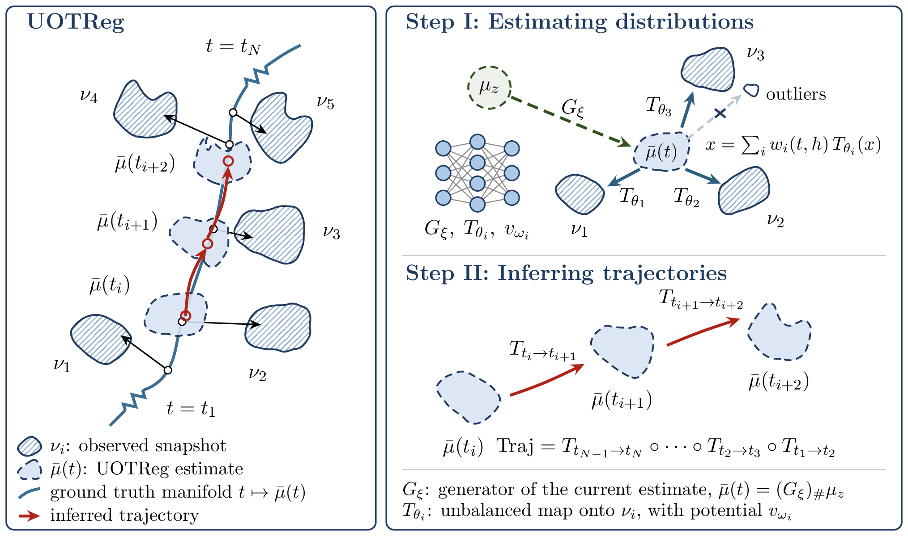

# UOTReg

Robust estimation of cell-state distributions and cell trajectories from time-course
single-cell data, via **local-Fréchet regression with unbalanced neural optimal transport**: the
distribution at any time is estimated as an unbalanced-OT barycenter of the observed snapshots
under local kernel weights, and individual cells are moved through the estimated
distributions by composed unbalanced-OT maps or a flow-matching field.



## Install

```bash
git clone https://github.com/Lizz647/UOTReg.git
cd UOTReg
```

With conda:

```bash
conda env create -f environment.yml   # creates the `uotreg` env: python 3.10 + requirements.txt
conda activate uotreg
pip install -e .                      # puts the `uotreg` package on the path
```

or with pip in any Python ≥ 3.10 environment:

```bash
pip install -r requirements.txt
pip install -e .
```

## The notebooks

Each experiment folder has **figure notebooks** and **training notebooks**.

**Figure notebooks** — `outlier_figs`, `divergence_figs`, `bifurcation_figs`, `reverse_figs`,
`loo_figs`, and `figures` / `fates_and_markers` / `cross_dimension`. They read the saved results under `results/` and produce the paper's figures and tables.

**Training notebooks** — `run_outliers`, `divergence_outliers` / `divergence_realdata`,
`*_estimate` → `*_trajectories`, `loo_embryoid` / `loo_statefate`, and
`estimate_and_trajectories`. These regenerate everything from the raw data. Since the training takes time, we set `smoke` variable for run a small and fast illustration.

```python
SMOKE = 1   # 1 = small and fast, runs on a laptop. NOT the paper's numbers.
            # 0 = the settings used in the paper.
```

A summary of all folders:

| folder | training | figures |
|---|---|---|
| `01_simulation_outliers` | `run_outliers` | `outlier_figs` |
| `02_simulation_divergence` | `divergence_outliers`, `divergence_realdata` | `divergence_figs` |
| `03_simulation_batcheffect` | `bifurcation_estimate` → `bifurcation_trajectories` | `bifurcation_figs` |
| `04_simulation_batcheffect_reverse` | `reverse_estimate` → `reverse_trajectories` | `reverse_figs` |
| `05_realdata_loo` | `loo_embryoid`, `loo_statefate` | `loo_figs` |
| `06_realdata_analysis` | `estimate_and_trajectories` | `figures`, `fates_and_markers`, `cross_dimension` |

To check an installation, run every notebook once at its `SMOKE = 1` defaults:

```bash
python tools/run_all_smoke.py
```

## License

MIT — see `LICENSE`.
